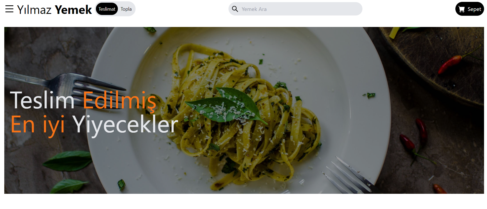

<h1>Tailwind CSS ile Tasarlanmış Bir React JS Web Sitesi </h1>

<h2>Gerekli bağımlılıkları kurmak için npm kurulumunu çalıştırıyoruz</h2>

API yanıtlarını simüle etmek için tüm veriler images/src/data/data.js konumunda bulunur.

Bu, hızlı bir şekilde web siteleri oluşturmak için kullanabileceğiniz süper güçlü bir ön uç kombinasyonu olan React & Tailwind'den oluşan eğlenceli küçük bir projeydi. Bu derlemede, belirli yiyecek türlerini ve fiyatlandırma kategorilerini filtrelemek için dizi filtresi yöntemiyle oluşturuldu.

Görmek için:https://food-app-rho-two.vercel.app/

